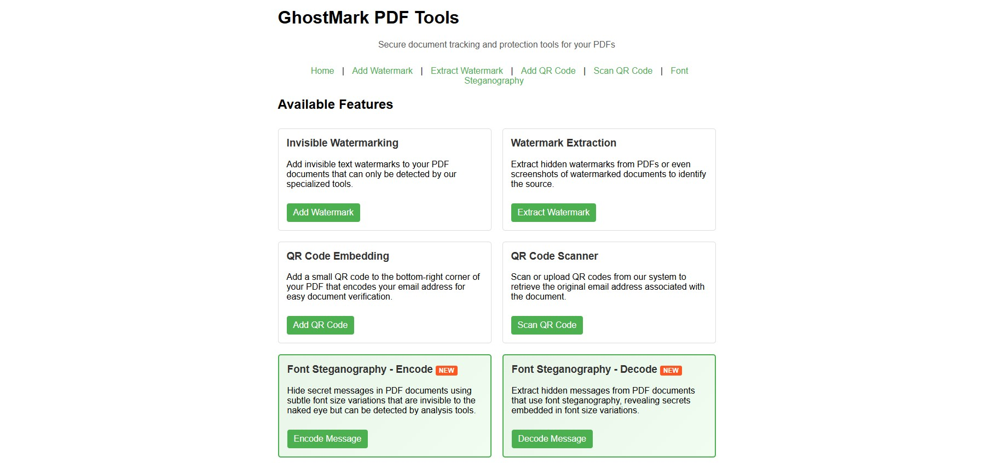

# 🔐 Ghostmark: PDF Security & Steganography Toolkit

A comprehensive document security platform that implements multiple advanced steganographic techniques for PDF watermarking, hidden data embedding, and tamper-evident document verification.


## 📸 Overview

### Development Interface (Temp)

*The web-based interface for uploading, processing, and managing PDF watermarks*

## 🌟 Features

### 🎭 Advanced Steganography Techniques
- **Invisible Watermarking**: Near-white color encoding that's imperceptible to human eye but machine-detectable
- **Font Steganography**: Novel binary encoding through subtle font size variations
- **QR Code Embedding**: Secure QR code insertion with Caesar cipher email obfuscation
- **Multi-layer Security**: Combines multiple techniques for robust protection

### 🔍 Computer Vision Pipeline
- **Automated Extraction**: OpenCV + Pytesseract integration for watermark detection
- **95%+ Accuracy**: High-precision watermark extraction from PDFs and screenshots
- **Print Media Resilience**: Maintains detectability across physical print-scan cycles
- **Real-time Processing**: Fast extraction and verification capabilities

### 🌐 Web Interface
- **Django Framework**: Professional web-based interface
- **AJAX Integration**: Real-time validation without page refreshes
- **Concurrent Processing**: Handle multiple file uploads simultaneously
- **Tamper Detection**: Verify document integrity and authenticity

## 🛠️ Technologies

- **Backend**: Python, Django, PyPDF2, PyMuPDF, ReportLab
- **Computer Vision**: OpenCV, Pytesseract
- **Security**: Custom cryptography implementations, Caesar cipher
- **Frontend**: HTML5, CSS3, JavaScript (AJAX)
- **Processing**: Multi-threaded file handling

## 📋 Prerequisites

- Python 3.8+
- Django 4.0+
- OpenCV 4.5+
- Tesseract OCR engine

## 🚀 Installation

1. **Clone the repository**
   ```bash
   git clone https://github.com/jali-k/ghostmark-pdf-tools.git
   cd ghostmark-pdf-tools
   ```

2. **Create virtual environment**
   ```bash
   python -m venv venv
   source venv/bin/activate  # On Windows: venv\Scripts\activate
   ```

3. **Install dependencies**
   ```bash
   pip install -r requirements.txt
   ```

4. **Install Tesseract OCR**
   - **Ubuntu/Debian**: `sudo apt-get install tesseract-ocr`
   - **macOS**: `brew install tesseract`
   - **Windows**: Download from [GitHub releases](https://github.com/UB-Mannheim/tesseract/wiki)

5. **Database setup**
   ```bash
   python manage.py makemigrations
   python manage.py migrate
   ```

6. **Run the application**
   ```bash
   python manage.py runserver
   ```

## 📖 Usage

### Embedding Watermarks

1. **Upload PDF Document**
   - Navigate to the upload page
   - Select your PDF file
   - Choose watermark type (invisible, font-based, or QR code)

2. **Configure Security Settings**
   - Set watermark text or data
   - Choose encoding strength
   - Configure Caesar cipher parameters (for QR codes)

3. **Generate Protected PDF**
   - Process the document
   - Download the watermarked PDF
   - Verify embedding success

### Extracting & Verifying Watermarks

1. **Upload Suspected Document**
   - Upload PDF or screenshot
   - Select detection algorithm

2. **Automated Analysis**
   - Computer vision pipeline processes the document
   - Extracts hidden watermarks
   - Provides confidence score

3. **Verification Results**
   - View extracted data
   - Check document authenticity
   - Generate verification report

## 🔧 API Reference

### Watermark Embedding
```python
POST /api/embed/
Content-Type: multipart/form-data

{
    "file": <PDF_FILE>,
    "watermark_type": "invisible|font|qr",
    "watermark_data": "Your secret data",
    "strength": 1-10
}
```

### Watermark Extraction
```python
POST /api/extract/
Content-Type: multipart/form-data

{
    "file": <PDF_OR_IMAGE_FILE>,
    "detection_method": "cv|ocr|hybrid"
}
```

## 📊 Performance

- **Processing Speed**: ~2-5 seconds per page
- **Accuracy Rate**: 95%+ watermark detection
- **File Size Impact**: <1% increase in PDF size
- **Print Resilience**: Survives 300+ DPI print-scan cycles

## 🧪 Testing

Run the test suite:
```bash
python manage.py test
```

Test specific modules:
```bash
python manage.py test steganography.tests
python manage.py test computer_vision.tests
```

## 📁 Project Structure

```
ghostmark-pdf-tools/
├── ghostmark/              # Main Django project
├── steganography/           # Core steganography algorithms
├── computer_vision/         # OpenCV processing pipeline
├── web_interface/           # Django web application
├── static/                  # CSS, JS, images
├── templates/               # HTML templates
├── tests/                   # Test suites
├── requirements.txt         # Python dependencies
└── README.md               # This file
```

## 🤝 Contributing

1. Fork the repository
2. Create a feature branch (`git checkout -b feature/AmazingFeature`)
3. Commit your changes (`git commit -m 'Add some AmazingFeature'`)
4. Push to the branch (`git push origin feature/AmazingFeature`)
5. Open a Pull Request


## 👨‍💻 Author

**Jaliya Kumarasiri**
- 🎓 Computer Engineering Student, University of Peradeniya
- 📧 Email: jaliya.r.kumarasiri@gmail.com
- 💼 LinkedIn: [Jaliya Kumarasiri](https://www.linkedin.com/in/jaliya-kumarasiri-5a71441b4/)
- 🐙 GitHub: [@jali-k](https://github.com/jali-k)


---

⭐ **If you found this project helpful, please give it a star!** ⭐
